# Assets1 — 银发通业务分析资产文档

> 版本：v1.0 | 更新日期：2026-06-27 | 适用范围：银发通适老化智慧就医服务平台

---

## 一、平台概述

银发通（Silver Hair Connect）面向老年群体及其子女，提供**线上预约挂号、AI 智能导诊、公益志愿者陪诊**一站式就医辅助服务。

### 1.1 用户角色

| 角色 | user_type | 说明 |
|------|-----------|------|
| 老年用户 | 1 | 直接使用平台挂号、导诊的老年人 |
| 子女用户 | 2 | 为长辈代办挂号、预约陪诊的子女 |
| 管理员 | 3 | 医院运营人员，管理排班/志愿者/订单 |

### 1.2 核心业务域

```
┌─────────────────────────────────────────────────────┐
│                    银发通平台                         │
├──────────┬──────────┬──────────┬──────────┬──────────┤
│ 用户中心 │ 预约挂号 │ 智能导诊 │ 陪诊服务 │ 健康管理 │
│ 注册登录 │ 排班号源 │ 症状匹配 │ 志愿者   │ 提醒     │
│ 长辈绑定 │ 候诊排队 │ Dify AI  │ 订单管理 │ 体检报告 │
│ 个人中心 │ 在线支付 │ ES搜索   │ 服务评价 │ 消息中心 │
└──────────┴──────────┴──────────┴──────────┴──────────┘
```

---

## 二、全局主业务活动流程图

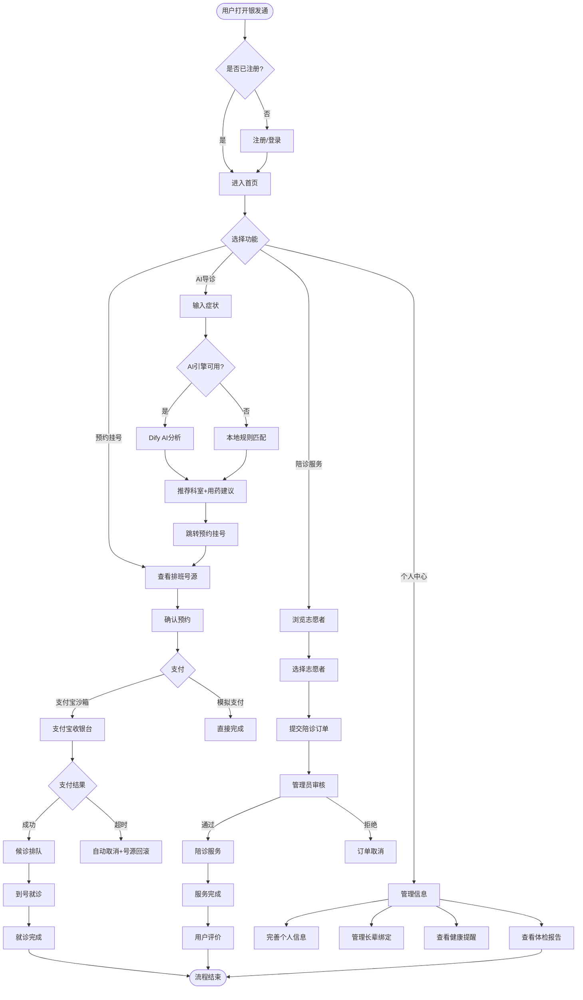

---

## 三、模块分层拆解与子活动流程图

### 3.1 认证授权模块（Auth）

#### 3.1.1 业务说明

支持三种登录方式：手机号密码、子女亲情登录（共用密码登录接口）、支付宝 OAuth 扫码。微信/银联预留接口。

#### 3.1.2 注册流程

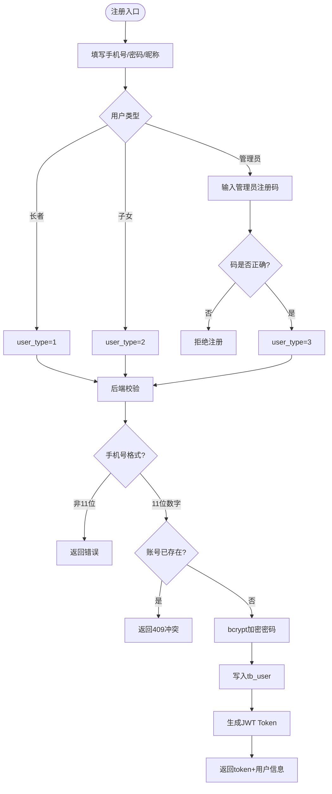

#### 3.1.3 登录流程

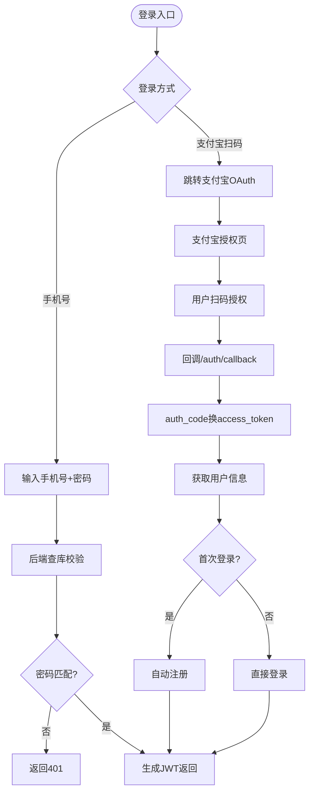

#### 3.1.4 业务规则

| 规则 | 说明 |
|------|------|
| 用户名格式 | 必须为11位纯数字手机号 |
| 密码要求 | >=6位，bcrypt单向加密存储 |
| 管理员注册 | 需提供 `admin_code`（配置项 `ADMIN_REGISTER_CODE`） |
| JWT有效期 | 24小时（1440分钟） |
| 支付宝首次登录 | 自动注册为老年用户（user_type=1） |
| 生产安全 | JWT_SECRET_KEY 为默认值时拒绝启动 |

---

### 3.2 用户中心模块（User）

#### 3.2.1 业务说明

管理个人信息完善、长辈绑定（子女代办场景）、代办任务与智能提醒。

#### 3.2.2 个人信息完善流程

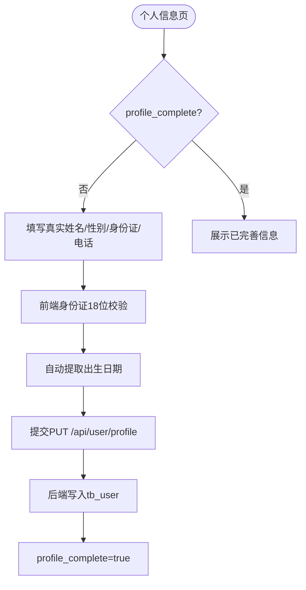

#### 3.2.3 长辈绑定流程

```mermaid
flowchart TD
    A([长辈管理页]) --> B[查看已绑定长辈列表]
    B --> C{操作}
    C -->|新增| D[填写长辈姓名/身份证/电话/性别/医保卡]
    C -->|编辑| E[修改长辈信息]
    C -->|解绑| F[确认后逻辑删除]

    D --> G{已绑定数量}
    G -->|>=5| H[提示已达上限]
    G -->|<5| I[POST /api/user/elders]
    I --> J[写入tb_elder_bind]

    E --> K[PUT /api/user/elders/{id}]
    F --> L[DELETE /api/user/elders/{id}]
    L --> M[is_deleted=1]
```

#### 3.2.4 代办任务生成逻辑

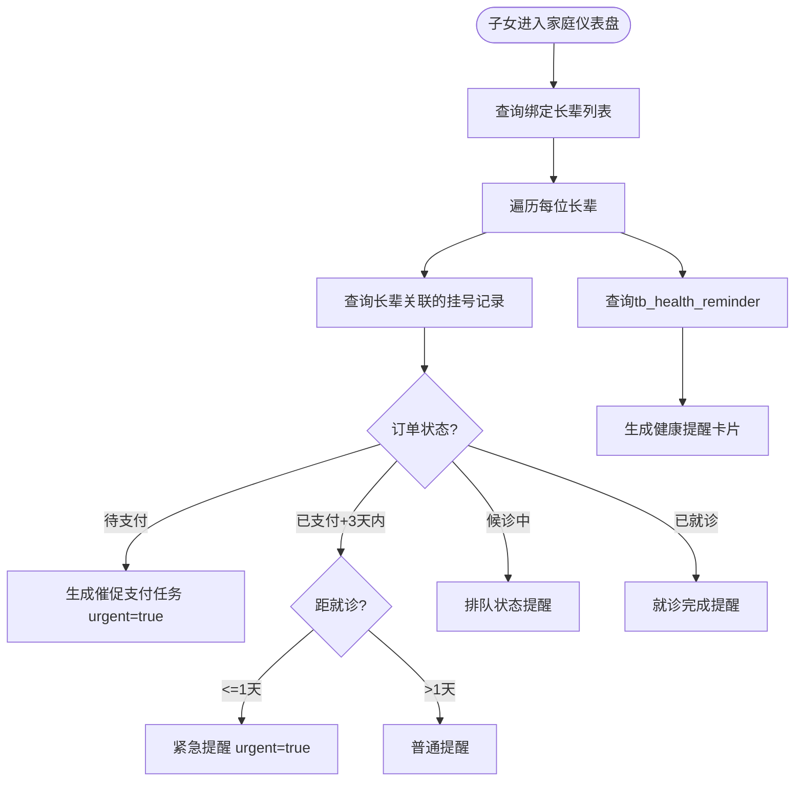

#### 3.2.5 业务规则

| 规则 | 说明 |
|------|------|
| 长辈上限 | 每位子女最多绑定5位长辈 |
| 身份证校验 | 18位正则 `\d{17}[\dXx]` |
| 自动提取生日 | 从身份证第7-14位提取 YYYYMMDD |
| profile_complete | real_name + gender + id_card + birthday 均非空时为 true |
| 软删除 | 解绑长辈使用逻辑删除（is_deleted=1） |

---

### 3.3 预约挂号模块（Reserve + Schedule + Queue）

#### 3.3.1 业务说明

平台核心模块，涵盖排班查看、号源管理、预约下单、在线支付、候诊排队全链路。

#### 3.3.2 预约挂号完整流程

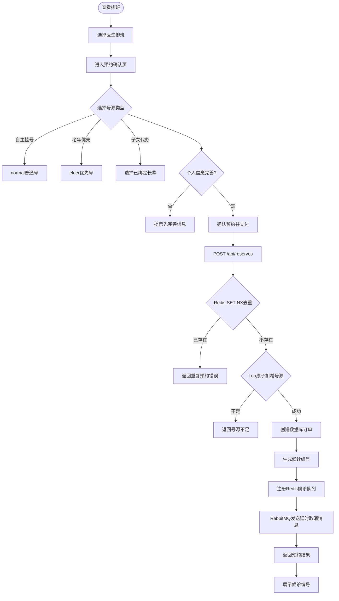

#### 3.3.3 支付与超时流程

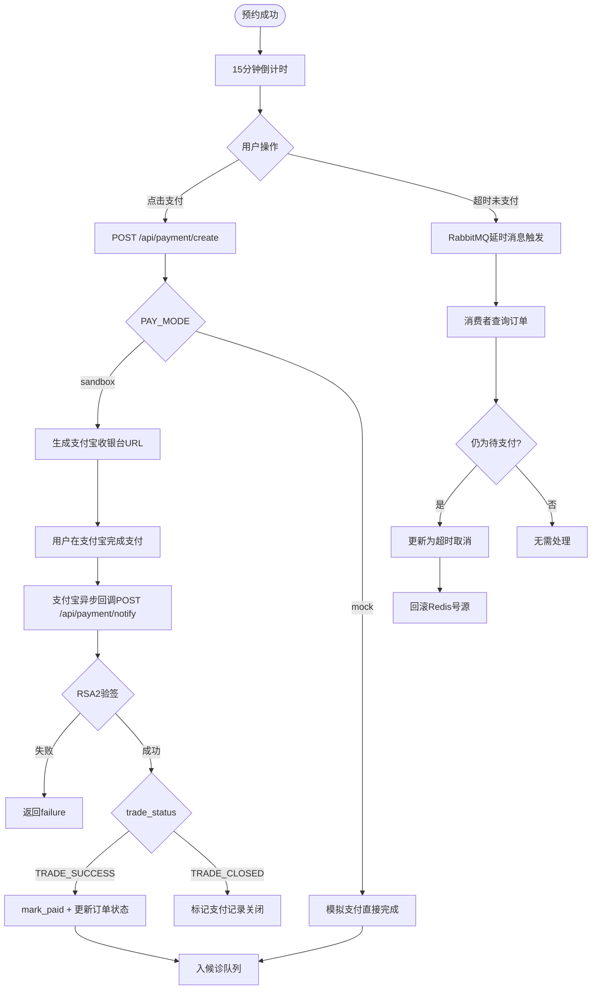

#### 3.3.4 候诊排队流程

```mermaid
flowchart TD
    A([支付成功]) --> B[获得候诊编号 NK+日期+流水号]
    B --> C[进入候诊状态]
    C --> D{查询排队位置}
    D --> E[GET /api/queue/my-position/{queue_code}]
    E --> F[返回: 我的编号/当前叫号/前方人数/预估等待]

    G([管理员/医生]) --> H[POST /api/queue/call-next/{schedule_id}]
    H --> I[递增queue:schedule_id:current]
    I --> J[发送候诊提醒消息]

    K([排班日期过后]) --> L[自动更新order_status=3已就诊]
```

#### 3.3.5 取消预约流程

```mermaid
flowchart TD
    A([用户点击取消]) --> B{订单状态}
    B -->|已取消| C[提示不可重复取消]
    B -->|其他| D{就诊日期}
    D -->|<=今天| E[提示到窗口办理]
    D -->|>今天| F[POST /api/reserves/{id}/cancel]
    F --> G[更新order_status=4]
    G --> H[回滚Redis号源]
    H --> I[清除去重标记]
```

#### 3.3.6 业务规则

| 规则 | 说明 |
|------|------|
| 支付超时 | 15分钟内未支付自动取消，RabbitMQ延时消息+定时任务兜底 |
| 预约去重 | Redis SET NX，key=`reserve_dedup:{schedule_id}:{user_id}`，TTL 900s |
| 号源原子扣减 | Lua脚本保证检查+扣减原子性，防止并发超卖 |
| 号源回滚 | 取消/超时自动INCRBY恢复 |
| 号源对账 | 每小时定时任务，以MySQL为准修复Redis |
| 候诊编号 | 格式 `NK{YYYYMMDD}{reserve_id:04d}` |
| 候诊预估 | 每人5分钟，`前方人数 × 5 = 预估等待分钟` |
| 当天不可取消 | `work_date <= today` 需到窗口办理 |
| 自动过期 | 查询详情时，排班日期已过+已预约 → 自动更新为已就诊 |
| 号源类型 | normal（普通号）和 elder（老年优先号）独立计数 |

---

### 3.4 在线支付模块（Payment）

#### 3.4.1 业务说明

支持支付宝沙箱支付和模拟支付两种模式，含创建订单、异步回调、主动同步三条路径。

#### 3.4.2 支付全流程

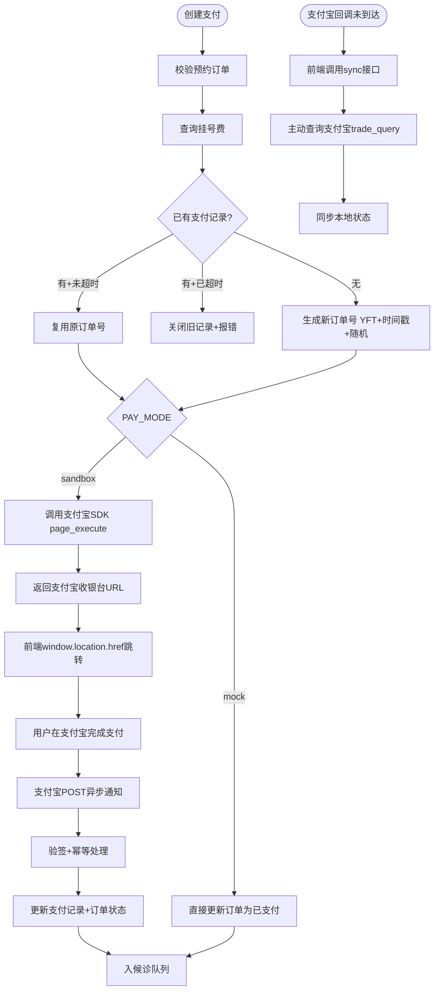

#### 3.4.3 业务规则

| 规则 | 说明 |
|------|------|
| 订单号格式 | `YFT{时间戳}{6位随机大写hex}` |
| 支付超时 | 15分钟 |
| 幂等保障 | `mark_paid` 使用 `WHERE pay_status=1` 防并发重复更新 |
| 验签策略 | fail-closed，验签失败直接返回failure |
| 降级方案 | sandbox不可用时可切mock模式 |
| 三重确认 | 异步回调 + 同步跳转 + 主动查询 |

---

### 3.5 AI智能导诊模块（Guide）

#### 3.5.1 业务说明

双引擎策略：Dify AI（主）+ 本地规则引擎（兜底）。输入症状文本，推荐科室+用药建议。

#### 3.5.2 导诊流程

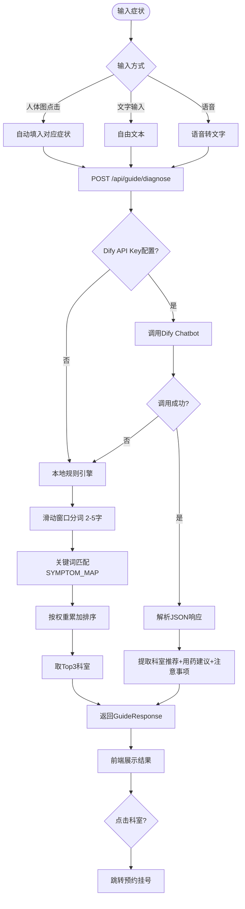

#### 3.5.3 症状词库覆盖

| 科室 | 条目数 | 典型关键词示例 |
|------|--------|---------------|
| 内科 | 6 | 发烧/发热/发烫/体温高/感冒/咳嗽/头疼/脑壳疼 |
| 消化科 | 6 | 胃疼/恶心/拉肚子/腹泻/便秘/食欲不振 |
| 心血管科 | 5 | 胸闷/高血压/心绞痛/气短/心慌 |
| 神经内科 | 6 | 偏瘫/手抖/面瘫/癫痫/麻木/记忆退化 |
| 骨科 | 7 | 腰疼/腿疼/骨折/摔断/颈椎/骨刺/肩周炎 |
| 外科 | 5 | 外伤/肿块/痔疮/结石/阑尾炎 |
| 眼科 | 2 | 视力模糊/眼睛疼/白内障/青光眼 |
| 耳鼻喉科 | 4 | 耳朵疼/鼻子堵/嗓子疼/打鼾 |
| 中医科 | 3 | 调理/推拿/体虚/气血不足 |
| 老年病科 | 3 | 体检/慢性病/多病共存 |

#### 3.5.4 业务规则

| 规则 | 说明 |
|------|------|
| 主引擎 | Dify Chatbot（通义千问+医学知识库） |
| 兜底引擎 | 本地规则引擎关键词匹配 |
| 降级条件 | Dify未配置/超时/出错时自动降级 |
| 分词策略 | 滑动窗口2-5字+原文整体匹配 |
| 结果数量 | 最多推荐3个科室+3个用药建议 |
| 紧急标志 | emergency_flag=true 时前端显示红色警示 |
| 引擎标识 | engine="dify" 或 "rule"，前端据此区分展示 |

---

### 3.6 ES搜索模块（Search）

#### 3.6.1 业务说明

基于Elasticsearch的全文搜索，覆盖医院、科室、医生、症状四类数据，使用IK中文分词器。

#### 3.6.2 搜索流程

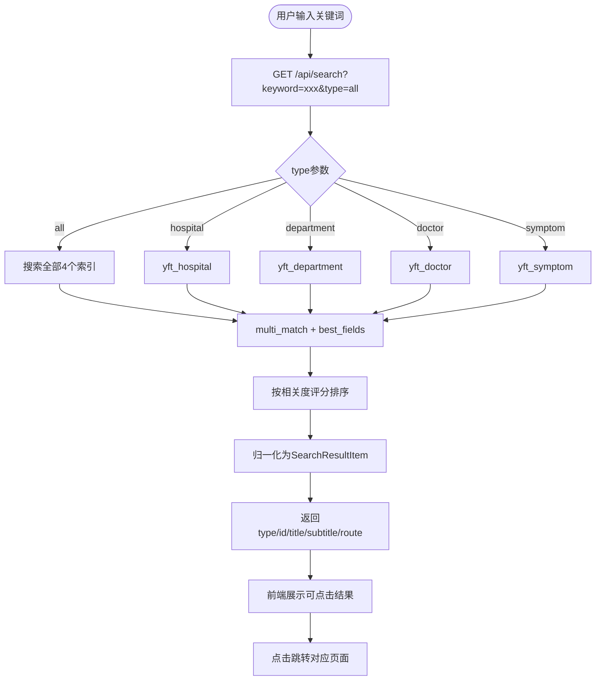

#### 3.6.3 数据同步策略

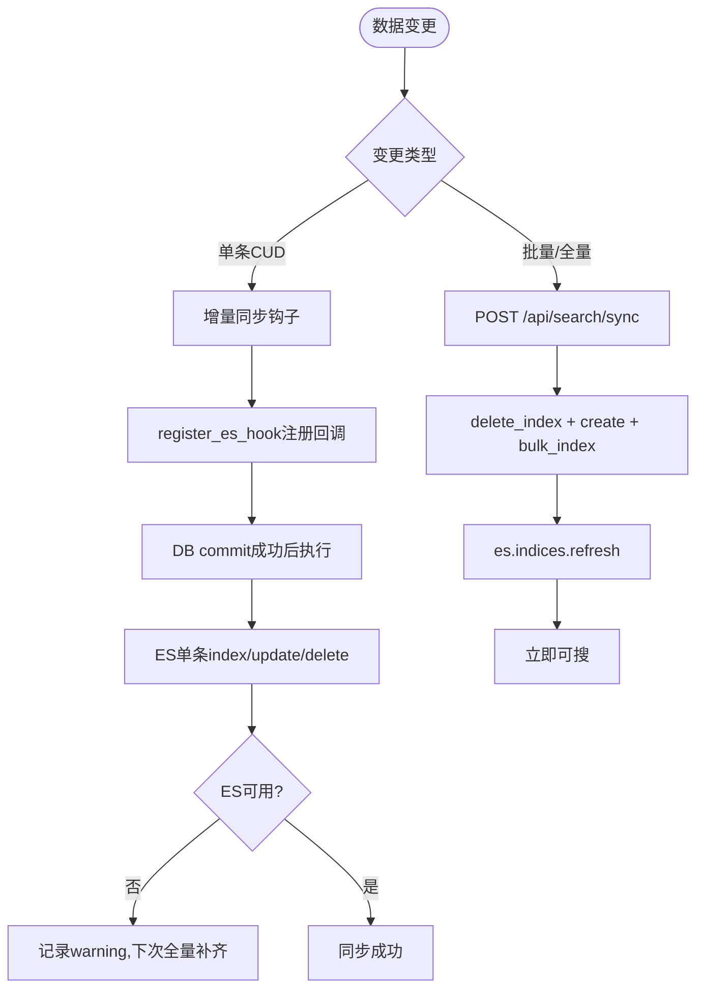

#### 3.6.4 索引结构

| 索引 | 搜索字段 | 分词策略 |
|------|----------|----------|
| yft_hospital | hospital_name^3, address | ik_max_word索引 / ik_smart搜索 |
| yft_department | dept_name^3, hospital_name | 同上 |
| yft_doctor | doctor_name^3, specialty^2, dept_name, hospital_name, doctor_title | 同上 |
| yft_symptom | keywords^3, dept_name | 同上 |

---

### 3.7 陪诊服务模块（Accompany）

#### 3.7.1 业务说明

公益陪诊服务，子女为长辈预约志愿者陪诊，含志愿者管理、订单流转、服务评价。

#### 3.7.2 陪诊下单与服务流程

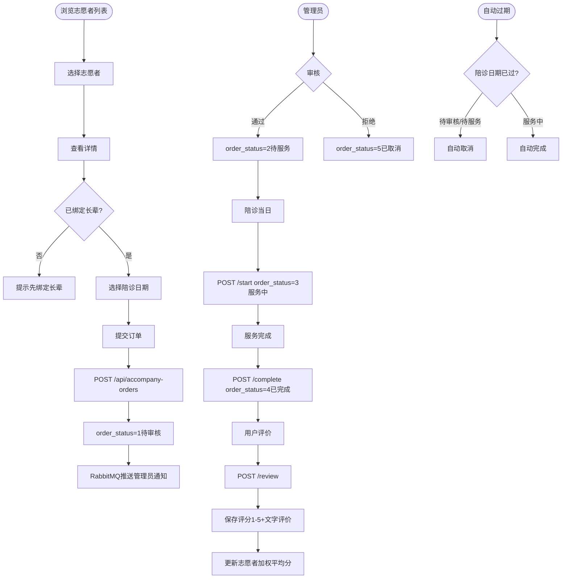

#### 3.7.3 评价算法

```
新评分 = (旧评分 × 旧次数 + 新评分) / (旧次数 + 1)
```

#### 3.7.4 业务规则

| 规则 | 说明 |
|------|------|
| 志愿者状态 | status=1可预约 / status=0不可预约 |
| 订单状态流转 | 待审核(1)→待服务(2)→服务中(3)→已完成(4)，可→已取消(5) |
| 评价时机 | order_status=3（服务中）时可评价 |
| 评价后自动完成 | 评价后自动更新为order_status=4 |
| 自动过期 | 日期过期+待审核/待服务→取消，日期过期+服务中→完成 |
| 价格 | 政府补贴，价格0元 |
| 长辈绑定 | 子女需先绑定长辈才能预约陪诊 |

---

### 3.8 健康提醒模块（Reminder）

#### 3.8.1 业务说明

基于RabbitMQ延迟队列的定时提醒，支持用药/复诊/体检三种类型，可设置每日循环。

#### 3.8.2 提醒创建与推送流程

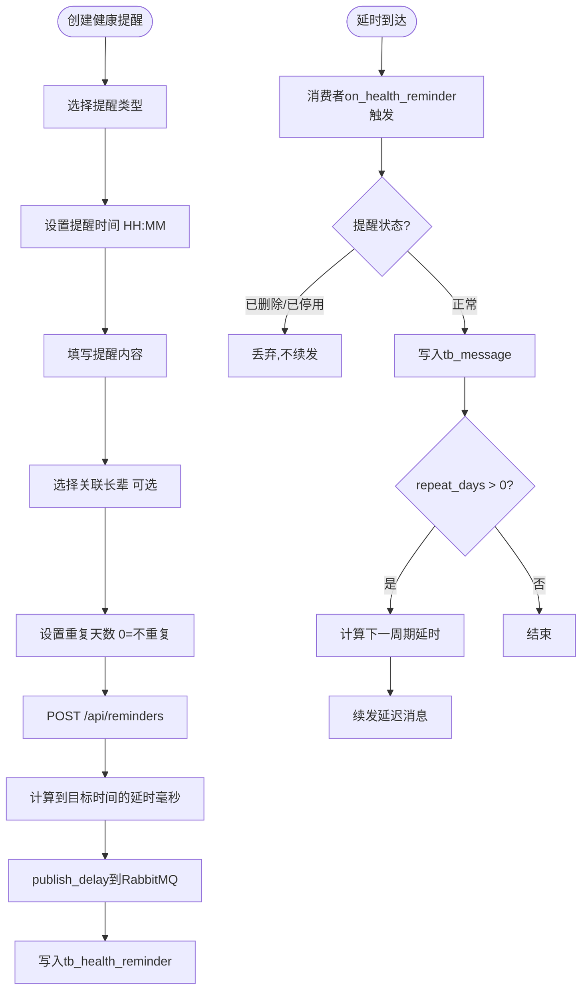

#### 3.8.3 业务规则

| 规则 | 说明 |
|------|------|
| 提醒类型 | medicine(用药) / revisit(复诊) / checkup(体检) |
| 时间格式 | HH:MM，自动计算到下一目标时间的延时 |
| 循环机制 | repeat_days > 0 时每日续发延迟消息 |
| 停用/删除 | 消费者遇到 is_deleted=1 或 is_active=0 直接丢弃，中断续发链 |
| 消息类型 | 写入tb_message时msg_type=4（健康提醒） |

---

### 3.9 消息中心模块（Message）

#### 3.9.1 业务说明

统一消息入口，汇集系统通知、挂号通知、候诊通知、健康提醒、陪诊通知。

#### 3.9.2 消息类型

| msg_type | 类型 | 来源 |
|----------|------|------|
| 1 | 系统通知 | 管理员/系统 |
| 2 | 挂号通知 | 预约成功时MQ推送 |
| 3 | 候诊通知 | 叫号/顺位变化时MQ推送 |
| 4 | 健康提醒 | 延迟队列消费者写入 |
| 5 | 陪诊通知 | 陪诊订单状态变更 |

#### 3.9.3 接口

- `GET /api/messages` — 消息列表（支持msg_type/read_status筛选）
- `POST /api/messages/{id}/read` — 标记已读
- `GET /api/messages/unread-count` — 未读数量

---

### 3.10 体检报告模块（Report）

#### 3.10.1 业务说明

子女上传长辈体检报告图片，系统OCR识别指标值，规则引擎生成通俗化解读。

#### 3.10.2 报告处理流程

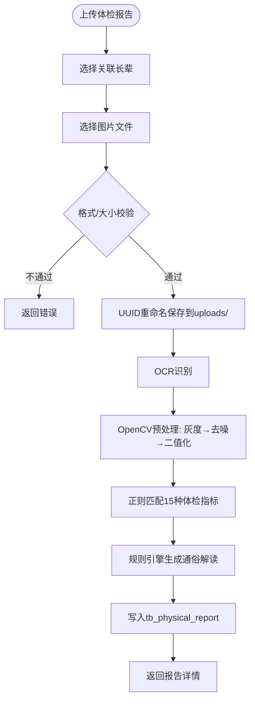

#### 3.10.3 支持的体检指标

| 指标 | 正常范围 | 解读维度 |
|------|----------|----------|
| 收缩压 | 90-140 mmHg | 偏高/正常/偏低 |
| 舒张压 | 60-90 mmHg | 偏高/正常/偏低 |
| 空腹血糖 | 3.9-6.1 mmol/L | 糖尿病风险 |
| 总胆固醇 | <5.2 mmol/L | 心血管风险 |
| 甘油三酯 | <1.7 mmol/L | 血脂异常 |
| 高密度脂蛋白 | >1.0 mmol/L | 好胆固醇 |
| 低密度脂蛋白 | <3.4 mmol/L | 坏胆固醇 |
| 尿酸 | 男<420 / 女<360 μmol/L | 痛风风险 |
| 肌酐 | 44-133 μmol/L | 肾功能 |
| 谷丙转氨酶 | 0-40 U/L | 肝功能 |
| 谷草转氨酶 | 0-40 U/L | 肝功能 |
| 白细胞 | 4-10 ×10⁹/L | 感染/免疫 |
| 红细胞 | 男4-5.5 / 女3.5-5 ×10¹²/L | 贫血 |
| 血红蛋白 | 男120-160 / 女110-150 g/L | 贫血 |
| 血小板 | 100-300 ×10⁹/L | 凝血功能 |

---

## 四、数据模型总览

### 4.1 核心数据表

| 表名 | 说明 | 核心字段 |
|------|------|----------|
| tb_user | 用户表 | username, password, user_type, real_name, id_card |
| tb_elder_bind | 长辈绑定 | child_uid, elder_name, elder_id_card, medical_card |
| tb_hospital | 医院 | hospital_name, hospital_level, address |
| tb_department | 科室 | dept_name, hospital_id(FK) |
| tb_doctor | 医生 | doctor_name, dept_id(FK), specialty, register_fee |
| tb_schedule | 排班 | doctor_id(FK), work_date, time_period, normal_num, elder_priority_num |
| tb_reserve | 预约订单 | user_id(FK), schedule_id(FK), queue_code, pay_status, order_status |
| tb_pay_record | 支付记录 | reserve_id(FK), out_trade_no, trade_no, pay_channel, pay_status |
| tb_volunteer | 志愿者 | vol_name, service_dept, service_score, service_count |
| tb_accompany_order | 陪诊订单 | user_id(FK), volunteer_id(FK), accompany_date, order_status |
| tb_health_reminder | 健康提醒 | user_id(FK), remind_type, remind_time, repeat_days |
| tb_message | 消息 | user_id(FK), msg_type, msg_content, read_status |
| tb_physical_report | 体检报告 | elder_bind_id(FK), report_url, ocr_result, interpretation |

### 4.2 状态枚举汇总

**订单状态 (order_status)**: 1=待支付 → 2=已预约 → 3=已就诊 → 4=已取消

**支付状态 (pay_status)**: 1=待支付 → 2=已支付 / 3=超时取消

**候诊状态 (queue_status)**: 1=等待中 → 2=就诊中 → 3=已完成

**陪诊订单状态**: 1=待审核 → 2=待服务 → 3=服务中 → 4=已完成 / 5=已取消

**用户类型 (user_type)**: 1=老年用户 / 2=子女用户 / 3=管理员

---

## 五、技术支撑与业务的映射关系

| 业务需求 | 技术方案 |
|----------|----------|
| 号源防超卖 | Redis Lua 原子脚本 |
| 预约防重复 | Redis SET NX + TTL |
| 支付超时取消 | RabbitMQ 延迟交换机（x-delayed-message） |
| 健康提醒定时推送 | RabbitMQ 延迟队列 + 消费者续发 |
| 候诊队列管理 | Redis 计数器 + Hash |
| 全文搜索 | Elasticsearch + IK中文分词器 |
| AI导诊 | Dify Chatbot（通义千问） + 本地规则引擎兜底 |
| 数据一致性 | 号源对账定时任务 + Post-Commit ES同步钩子 |
| 统一认证 | JWT (HS256, 24h有效期) |
| 数据安全 | bcrypt密码加密 + 软删除 + 全局异常处理 |
